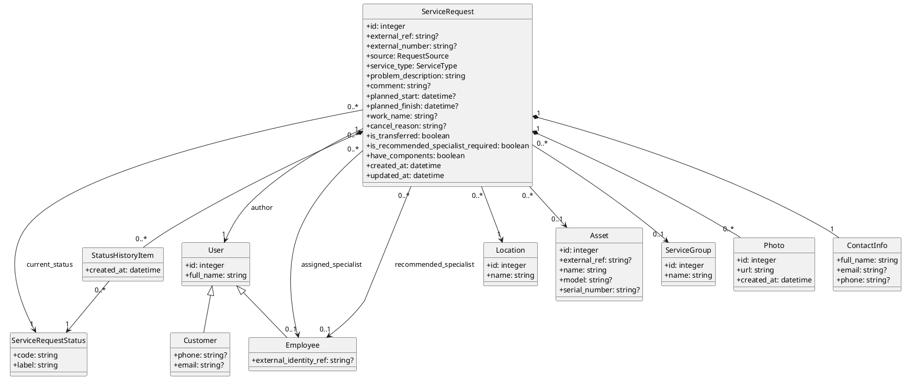

# Системная спецификация: модуль сервисных заявок

| Параметр | Значение |
|---|---|
| Документ | System Specification |
| Версия | 1.1 |
| Статус | Демонстрационный обезличенный артефакт |
| API style | REST / JSON |
| Авторизация | Bearer token |
| Интеграция | Асинхронный обмен с внешней ERP |

## 1. Назначение документа

Документ описывает системную модель модуля сервисных заявок: сущности, связи, API между клиентским приложением и backend, асинхронную интеграцию backend–ERP и унифицированную обработку ошибок.

## 2. Границы системы

- Клиентское web/mobile-приложение обращается только к backend API.
- Backend проверяет доступ пользователя к локациям и данным.
- Backend хранит локальную запись заявки и асинхронно передаёт её в ERP.
- ERP является источником последующих изменений статуса и части служебных данных.
- Клиент не получает прямого доступа к ERP API.

## 3. Термины и сокращения

| Термин | Описание |
|---|---|
| ServiceRequest | Сервисная заявка клиента. |
| Asset | Оборудование, для которого создаётся заявка. |
| Location | Локация клиента. |
| ERP | Внешняя учётная система. |
| DTO | Структура передачи данных между компонентами. |
| draft | Локальный клиентский статус до успешной передачи в ERP. |
| created | Клиентский статус созданной заявки после маппинга ERP. |
| final status | Клиентский статус `complete` или `canceled`. |
| Retry | Повторная автоматическая попытка операции. |

## 4. Сущности

### 4.1 ServiceRequest

| Атрибут | Тип | Обязательность | Описание | Источник |
|---|---|---|---|---|
| id | integer | Да | Внутренний идентификатор | Backend |
| external_ref | string | Нет | Идентификатор заявки в ERP | ERP |
| external_number | string | Нет | Номер заявки в ERP | ERP |
| source | enum `CLIENT`, `ERP` | Да | Источник создания | Backend / ERP |
| author | UserSummary | Условно | Автор; может отсутствовать для заявки из ERP | Backend |
| assigned_specialist | EmployeeSummary | Нет | Назначенный специалист | ERP |
| recommended_specialist | EmployeeSummary | Нет | Рекомендованный специалист | ERP |
| location | Location | Да | Локация клиента | Backend |
| asset | Asset | Нет | Оборудование | Backend / ERP |
| service_group | ServiceGroup | Нет | Ответственная сервисная группа | ERP |
| contact | ContactInfo | Да | Контактное лицо | Backend |
| status | ServiceRequestStatus | Да | Текущий статус | Backend / ERP |
| service_type | enum `MAINTENANCE`, `REPAIR` | Да | Тип сервиса | Client |
| problem_description | string | Да | Описание проблемы | Client |
| comment | string | Нет | Комментарий сервисной службы | ERP |
| planned_start | datetime | Нет | Плановое начало | ERP |
| planned_finish | datetime | Нет | Плановое окончание | ERP |
| work_name | string | Нет | Наименование работ | ERP |
| cancel_reason | string | Нет | Причина отмены | ERP |
| is_transferred | boolean | Да | Признак передачи другому специалисту | ERP |
| is_recommended_specialist_required | boolean | Да | Ограничение назначения | ERP |
| have_components | boolean | Да | Наличие компонентов | ERP |
| photos | array<Photo> | Да | Фотографии клиента; пустой массив допустим | Backend |
| status_history | array<StatusHistoryItem> | Нет | История статусов | Backend / ERP |
| created_at | datetime | Да | Дата создания | Backend |
| updated_at | datetime | Да | Дата обновления | Backend |

### 4.2 ServiceRequestStatus

| Атрибут | Тип | Обязательность | Описание |
|---|---|---|---|
| code | string | Да | Клиентский машинный код после маппинга ERP |
| label | string | Да | Пользовательское наименование |

### 4.3 StatusHistoryItem

| Атрибут | Тип | Обязательность | Описание |
|---|---|---|---|
| status | ServiceRequestStatus | Да | Зафиксированный статус |
| created_at | datetime | Да | Дата перехода |

### 4.4 UserSummary

| Атрибут | Тип | Обязательность | Описание |
|---|---|---|---|
| id | integer | Да | Внутренний идентификатор |
| full_name | string | Да | Отображаемое имя |

### 4.5 Customer

| Атрибут | Тип | Обязательность | Описание |
|---|---|---|---|
| user | UserSummary | Да | Базовые данные пользователя |
| phone | string | Нет | Контактный телефон |
| email | string | Нет | Электронная почта |

### 4.6 EmployeeSummary

| Атрибут | Тип | Обязательность | Описание |
|---|---|---|---|
| id | integer | Да | Внутренний идентификатор |
| full_name | string | Да | Отображаемое имя |
| external_identity_ref | string | Нет | Идентификатор во внешнем сервисе идентификации |

### 4.7 Location

| Атрибут | Тип | Обязательность | Описание |
|---|---|---|---|
| id | integer | Да | Внутренний идентификатор |
| name | string | Да | Наименование локации |

### 4.8 Asset

| Атрибут | Тип | Обязательность | Описание |
|---|---|---|---|
| id | integer | Да | Внутренний идентификатор |
| external_ref | string | Нет | Идентификатор в ERP |
| name | string | Да | Наименование оборудования |
| model | string | Нет | Модель |
| serial_number | string | Нет | Серийный номер |

### 4.9 ServiceGroup

| Атрибут | Тип | Обязательность | Описание |
|---|---|---|---|
| id | integer | Да | Внутренний идентификатор |
| name | string | Да | Наименование сервисной группы |

### 4.10 Photo

| Атрибут | Тип | Обязательность | Описание |
|---|---|---|---|
| id | integer | Да | Идентификатор файла |
| url | string | Да | Доступная авторизованному клиенту ссылка |
| created_at | datetime | Да | Дата загрузки |

### 4.11 ContactInfo

| Атрибут | Тип | Обязательность | Описание |
|---|---|---|---|
| full_name | string | Да | ФИО контактного лица |
| email | string | Нет | Электронная почта |
| phone | string | Нет | Телефон |

## 5. Связи между сущностями

| Сущность 1 | Связь | Сущность 2 | Описание |
|---|---|---|---|
| ServiceRequest | many-to-one | Location | Каждая заявка относится к одной локации. |
| ServiceRequest | many-to-zero/one | Asset | Оборудование необязательно. |
| ServiceRequest | many-to-one | UserSummary | Автор локально созданной заявки. |
| ServiceRequest | many-to-zero/one | EmployeeSummary | Назначенный специалист. |
| ServiceRequest | many-to-zero/one | EmployeeSummary | Рекомендованный специалист. |
| ServiceRequest | many-to-zero/one | ServiceGroup | Ответственная группа. |
| ServiceRequest | one-to-many | Photo | У заявки может быть несколько фотографий. |
| ServiceRequest | one-to-many | StatusHistoryItem | История изменения статусов. |
| Customer | one-to-one | UserSummary | Клиент расширяет базовые данные пользователя. |

## 6. Диаграмма классов



Исходник: `diagrams/class-diagram.puml`.

## 7. Статусы и жизненный цикл

Внутренние коды ERP в публичной версии нормализованы. Backend преобразует ERP-статус в клиентский статус до сохранения DTO, отображения в списке, карточке и истории.

| Внутреннее состояние | Статус ERP (label) | ERP code (обезличено) | Client label | Client code | `is_final` |
|---|---|---|---|---|---:|
| `DRAFT` | — | — | Черновик | `draft` | false |
| `CREATED` | Создано | `ERP_CREATED` | Создан | `created` | false |
| `RECEIVED_FROM_CLIENT` | Получено от клиента | `ERP_RECEIVED_FROM_CLIENT` | Создан | `created` | false |
| `PROCESSING` | Отправлено в работу | `ERP_SENT_TO_WORK` | Обрабатывается | `processing` | false |
| `COMPONENTS_AWAIT` | Ожидает поставки запчастей | `ERP_WAITING_FOR_PARTS` | Ожидает поставки запчастей | `components_await` | false |
| `ENGINEER_ASSIGNED` | — | — | Назначен инженер | `engineer_assigned` | false |
| `ENGINEER_ARRIVED` | — | — | Инженер прибыл | `engineer_arrived` | false |
| `IN_PROGRESS` | Выполняется | `ERP_IN_PROGRESS` | Выполнен | `complete` | true |
| `HAS_SERVICE_REPORT` | Оформлен отчёт о выполненных работах | `ERP_REPORT_CREATED` | Выполнен | `complete` | true |
| `COMPLETE` | Выполнено | `ERP_COMPLETED` | Выполнен | `complete` | true |
| `CANCELED` | Отменено без выполнения | `ERP_CANCELED` | Отменен | `canceled` | true |
| `ENGINEER_TRANSFER` | Передать другому инженеру | `ERP_TRANSFER_ENGINEER` | Назначен инженер | `engineer_assigned` | false |
| `PLANNED` | Запланировано | `ERP_PLANNED` | Обрабатывается | `processing` | false |

**Правила жизненного цикла:**

1. `draft` устанавливает backend при локальном создании.
2. Через 5 минут после последнего изменения backend начинает передачу в ERP.
3. До успешной передачи клиент может изменять и удалять заявку.
4. После успешной передачи в ERP клиент не может изменить или удалить заявку.
5. Ошибка передачи не создаёт новый клиентский статус; backend продолжает retry.
6. Клиентские статусы `complete` и `canceled` считаются финальными и по умолчанию не входят в список активных заявок.
7. История статусов хранит клиентское представление после применения маппинга.

## 8. Общие API-соглашения

- Формат: JSON, кроме загрузки файлов.
- Кодировка: UTF-8.
- Даты: ISO 8601.
- Авторизация: `Authorization: Bearer <token>`.
- Имена полей: `snake_case`.
- Пагинация списка: cursor-based, до 100 записей в одной порции.
- Frontend не передаёт ключ идемпотентности. Стабильный `external_id` формирует backend и использует при передаче и retry в ERP.

### 8.1 Унифицированная ошибка

```json
{
  "code": "VALIDATION_ERROR",
  "message": "Проверьте заполнение формы",
  "details": [
    {
      "field": "problem_description",
      "message": "Поле обязательно"
    }
  ],
  "request_id": "req_demo_001"
}
```

`request_id` предназначен для поиска технической записи в логах и не содержит внутренних сведений.

## 9. DTO ответа ServiceRequest

```json
{
  "id": 421,
  "external_ref": "EXT-7D9F2",
  "external_number": "SR-000421",
  "source": "CLIENT",
  "status": {
    "code": "created",
    "label": "Создан"
  },
  "author": {
    "id": 17,
    "full_name": "Демонстрационный пользователь"
  },
  "assigned_specialist": null,
  "recommended_specialist": null,
  "location": {
    "id": 11,
    "name": "Производственная площадка"
  },
  "asset": {
    "id": 73,
    "external_ref": "ASSET-73",
    "name": "Промышленная установка",
    "model": "Model A",
    "serial_number": "DEMO-00073"
  },
  "service_type": "REPAIR",
  "problem_description": "Оборудование работает нестабильно",
  "comment": null,
  "planned_start": null,
  "planned_finish": null,
  "service_group": null,
  "work_name": null,
  "contact": {
    "full_name": "Демонстрационный пользователь",
    "email": "user@example.test",
    "phone": "+70000000000"
  },
  "cancel_reason": null,
  "is_transferred": false,
  "is_recommended_specialist_required": false,
  "have_components": false,
  "photos": [
    {
      "id": 91,
      "url": "https://example.test/files/photo-91.jpg",
      "created_at": "2026-06-01T10:00:00Z"
    }
  ],
  "status_history": [
    {
      "status": {
        "code": "created",
        "label": "Создан"
      },
      "created_at": "2026-06-01T10:05:00Z"
    }
  ],
  "created_at": "2026-06-01T10:00:00Z",
  "updated_at": "2026-06-01T10:05:00Z"
}
```

## 10. Сводная таблица методов frontend–backend

| ID | Метод | Endpoint | Назначение | Авторизация |
|---|---|---|---|---|
| API-SR-001 | GET | `/api/v1/service-requests` | Получить список заявок | Да |
| API-SR-002 | POST | `/api/v1/service-requests` | Создать заявку | Да |
| API-SR-003 | GET | `/api/v1/service-requests/{service_request_id}` | Получить карточку | Да |
| API-SR-004 | PATCH | `/api/v1/service-requests/{service_request_id}` | Изменить черновик | Да |
| API-SR-005 | POST | `/api/v1/service-request-photos` | Загрузить фотографию | Да |
| API-SR-006 | DELETE | `/api/v1/service-requests/{service_request_id}` | Удалить черновик | Да |
| API-SR-007 | GET | `/api/v1/support/contact-info` | Получить контакты сервисной службы | Да |
| API-SR-008 | POST | `/api/v1/support-requests` | Отправить обращение | Да |

## 11. Описание методов frontend–backend

### API-SR-001. Получить список заявок

**GET** `/api/v1/service-requests`

| Параметр | Тип | Обязательность | Описание |
|---|---|---|---|
| cursor | string | Нет | Курсор следующей порции |
| statuses | array<string> | Нет | Коды статусов |
| location_ids | array<integer> | Нет | Идентификаторы локаций |
| service_types | array<string> | Нет | `MAINTENANCE`, `REPAIR` |
| asset_ids | array<integer> | Нет | Идентификаторы оборудования |
| asset_id_isnull | boolean | Нет | Отбор заявок без оборудования |
| q | string | Нет | Регистронезависимый поиск |

Поиск выполняется по статусу, внешнему номеру, оборудованию, серийному номеру и типу сервиса.

**200 OK**

```json
{
  "results": [
    {
      "id": 421,
      "external_number": "SR-000421",
      "source": "CLIENT",
      "status": {"code": "created", "label": "Создан"},
      "location": {"id": 11, "name": "Производственная площадка"},
      "asset": {"id": 73, "name": "Промышленная установка", "serial_number": "DEMO-00073"},
      "service_type": "REPAIR",
      "problem_description": "Оборудование работает нестабильно",
      "created_at": "2026-06-01T10:00:00Z",
      "updated_at": "2026-06-01T10:05:00Z"
    }
  ],
  "next_cursor": "cursor_demo_next",
  "previous_cursor": null
}
```

**Ошибки:** `401`, `403`, `422`, `500`.

### API-SR-002. Создать заявку

**POST** `/api/v1/service-requests`

Frontend не формирует и не передаёт ключ идемпотентности. Backend создаёт локальную заявку, а стабильный внешний идентификатор операции формируется при постановке заявки в очередь ERP-синхронизации.

#### Request body

| Поле | Тип | Обязательность | Описание |
|---|---|---|---|
| service_type | enum | Да | `MAINTENANCE` или `REPAIR` |
| location_id | integer | Да | Доступная пользователю локация |
| asset_id | integer/null | Нет | Оборудование; `null`, если не выбрано |
| problem_description | string | Да | Описание проблемы |
| photo_ids | array<integer> | Нет | До 5 ранее загруженных фотографий JPEG, каждая до 5 МБ |

```json
{
  "service_type": "REPAIR",
  "location_id": 11,
  "asset_id": 73,
  "problem_description": "Оборудование работает нестабильно",
  "photo_ids": [91, 92]
}
```

**201 Created** — полный DTO `ServiceRequest`. До ответа ERP поля `external_ref` и `external_number` могут быть `null`, статус — `draft`.

**Ошибки:** `401`, `403`, `404`, `422`, `500`.

### API-SR-003. Получить карточку заявки

**GET** `/api/v1/service-requests/{service_request_id}`

| Параметр | Тип | Обязательность | Описание |
|---|---|---|---|
| service_request_id | integer | Да | Внутренний идентификатор |

**200 OK** — полный DTO `ServiceRequest`.

**Ошибки:** `401`, `403`, `404`, `500`.

### API-SR-004. Изменить черновик

**PATCH** `/api/v1/service-requests/{service_request_id}`

Метод доступен только для статуса `DRAFT`.

#### Request body

Поля аналогичны созданию; передаются только изменяемые значения.

```json
{
  "service_type": "MAINTENANCE",
  "problem_description": "Требуется плановое обслуживание",
  "photo_ids": [91, 92]
}
```

**200 OK** — полный DTO `ServiceRequest`.

**Ошибки:** `401`, `403`, `404`, `409 REQUEST_NOT_DRAFT`, `422`, `500`.

### API-SR-005. Загрузить фотографию

**POST** `/api/v1/service-request-photos`

`Content-Type: multipart/form-data`

| Поле | Тип | Обязательность | Ограничения | Описание |
|---|---|---|---|---|
| image | binary | Да | JPEG, не более 5 МБ | Один файл фотографии |

Для добавления нескольких фотографий клиент выполняет несколько запросов и передаёт полученные `id` в `photo_ids`. К одной заявке можно привязать не более 5 фотографий.

**201 Created**

```json
{
  "id": 91,
  "url": "https://example.test/files/photo-91.jpg",
  "created_at": "2026-06-01T10:00:00Z"
}
```

**Ошибки:** `400`, `401`, `403`, `413`, `415`, `422`, `500`.

### API-SR-006. Удалить черновик

**DELETE** `/api/v1/service-requests/{service_request_id}`

Удаление разрешено только для `DRAFT`, не подтверждённого ERP.

**204 No Content**.

**Ошибки:** `401`, `403`, `404`, `409 REQUEST_NOT_DRAFT`, `500`.

### API-SR-007. Получить контактные данные сервисной службы

**GET** `/api/v1/support/contact-info`

| Параметр | Тип | Обязательность | Описание |
|---|---|---|---|
| service_group_id | integer | Да | Идентификатор сервисной группы |

**200 OK**

```json
{
  "phone": "+70000000000",
  "email": "service@example.test"
}
```

**Ошибки:** `401`, `403`, `404`, `500`.

### API-SR-008. Отправить обращение в поддержку

**POST** `/api/v1/support-requests`

| Поле | Тип | Обязательность | Ограничение | Описание |
|---|---|---|---|---|
| message | string | Да | До 500 символов | Сообщение пользователя |
| service_request_id | integer | Да | — | Заявка, к которой относится обращение |

Категории обращений не используются. Пользователь не задаёт тему: backend формирует её по единому стандартному шаблону.

```json
{
  "message": "Прошу уточнить текущее состояние заявки",
  "service_request_id": 421
}
```

**200 OK**

```json
{
  "status": "ACCEPTED",
  "message": "Обращение принято"
}
```

**Ошибки:** `401`, `403`, `404`, `422`, `500`.

## 12. Интеграция backend–ERP

### 12.1 Scope интеграции

Для клиентского модуля используются только следующие обезличенные ERP-методы:

| ID | Метод | Публичное имя endpoint | Назначение |
|---|---|---|---|
| ERP-SR-001 | POST | `/integration/v1/erp/service-requests` | Создать заявку в ERP |
| ERP-SR-002 | GET | `/integration/v1/erp/service-requests` | Получить одну заявку или выполнить плановую синхронизацию списка |
| ERP-SR-003 | GET | `/integration/v1/erp/service-request-statuses` | Получить справочник ERP-статусов для контроля маппинга |

Не включены в scope:

- ERP `PATCH`: клиентский модуль не изменяет заявку после успешной передачи;
- справочник причин отмены: прямая отмена клиентом не предусмотрена;
- справочник видов ремонта: клиентский модуль использует локальные типы `MAINTENANCE` и `REPAIR`;
- методы оборудования: оборудование поступает из общего справочного контура и не является частью интеграции данного модуля;
- методы коммерческих предложений и отчётов: документы располагаются в отдельном разделе приложения.

### 12.2 ERP-SR-001. Создание заявки

**Триггер:** через 5 минут после последнего изменения локальной заявки в статусе `draft`.

#### Маппинг запроса

| Поле backend | Поле ERP (обезличено) | Обязательность | Правило |
|---|---|---|---|
| integration_key | external_id | Да | Стабильный идентификатор; одинаковый для первой и всех повторных попыток |
| location.external_ref | location_id | Да | Внешний идентификатор локации |
| asset.external_ref | equipment_id | Да | При отсутствии оборудования адаптер передаёт служебное значение ERP |
| service_type | service_type | Да | Преобразуется в значение «Техническое обслуживание» или «Ремонт» |
| problem_description | problem_description | Нет в ERP | Передаётся при наличии |
| photos | photo | Нет | ERP-контракт содержит одно строковое поле; формат передачи нескольких фотографий не определён |

```json
{
  "external_id": "REQ-DEMO-421",
  "location_id": "LOC-DEMO-11",
  "equipment_id": "ASSET-DEMO-73",
  "service_type": "REPAIR",
  "problem_description": "Оборудование работает нестабильно",
  "photo": "[anonymized payload]"
}
```

#### Используемые поля ответа

| Поле ERP (обезличено) | Назначение |
|---|---|
| action_status | Результат выполнения операции |
| erp_id | Внешний идентификатор заявки |
| erp_number | Внешний номер заявки |
| location_id | Контроль связанной локации |
| author_id | Внешний идентификатор автора |
| problem_description | Контроль сохранённого описания |

```json
{
  "action_status": "SUCCESS",
  "erp_id": "ERP-REQ-DEMO-421",
  "erp_number": "SR-DEMO-000421",
  "location_id": "LOC-DEMO-11",
  "author_id": "USER-DEMO-17",
  "problem_description": "Оборудование работает нестабильно"
}
```

После успешного ответа backend сохраняет `erp_id` и `erp_number`; заявка становится недоступна клиенту для изменения. Операционные данные и актуальный статус далее обновляются методом ERP-SR-002.

### 12.3 Retry и идемпотентность

1. Frontend не передаёт ключ идемпотентности.
2. Backend формирует стабильный `external_id` при постановке локальной заявки в очередь ERP.
3. Первая попытка выполняется через 5 минут после последнего изменения.
4. При неуспехе retry выполняются через 30 секунд, затем через 1 минуту, затем через 2 минуты и далее каждые 2 минуты.
5. Повторные попытки продолжаются до успешной отправки.
6. Пользователь не получает синхронную ошибку ERP: заявка остаётся в локальном состоянии и обновляется после успеха.

> Риск: отдельные правила прекращения retry для невосстановимых бизнес-ошибок и обязательный операционный аудит не предъявлены.

### 12.4 ERP-SR-002. Получение заявок и синхронизация

Используемые режимы:

- без параметров — плановое получение списка заявок;
- с параметром `id` — точечное получение конкретной заявки.

Плановая синхронизация выполняется один раз в 15 минут.

#### Маппинг ответа ERP

| Поле ERP (обезличено) | Поле backend | Правило |
|---|---|---|
| erp_id | external_ref | Внешний идентификатор |
| erp_number | external_number | Внешний номер |
| status | status | Преобразуется по карте ERP → client |
| assigned_engineer_id | assigned_specialist | Разрешается через справочник сотрудников |
| repair_type_id | Внутренняя ссылка на вид ремонта | Не изменяет клиентский `service_type` без отдельного подтверждённого маппинга |
| planned_start_date | planned_start | ISO 8601 datetime |
| planned_end_date | planned_finish | ISO 8601 datetime |
| problem_description | problem_description | Поле клиента |
| comment | comment | Комментарий сервисной службы |
| service_group_id | service_group | Разрешается через справочник групп |
| work_name | work_name | Наименование работ |
| cancel_reason | cancel_reason | Причина отмены |
| have_components | have_components | Признак наличия компонентов |

```json
[
  {
    "erp_id": "ERP-REQ-DEMO-421",
    "erp_number": "SR-DEMO-000421",
    "status": "Выполнено",
    "assigned_engineer_id": "EMP-DEMO-9",
    "repair_type_id": "TYPE-DEMO-2",
    "planned_start_date": "2026-06-02T09:00:00Z",
    "planned_end_date": "2026-06-02T12:00:00Z",
    "problem_description": "Оборудование работает нестабильно",
    "comment": "Работы согласованы",
    "service_group_id": "SG-DEMO-1",
    "work_name": "Диагностика и ремонт",
    "cancel_reason": "",
    "have_components": true
  }
]
```

Backend выполняет upsert локальной заявки, применяет маппинг статуса и добавляет изменение в историю, если клиентский статус изменился.

### 12.5 ERP-SR-003. Справочник статусов

Метод возвращает ERP-код и наименование статуса. Backend не передаёт значения в UI напрямую, а применяет таблицу из раздела 7.

```json
[
  {"erp_id": "ERP_CREATED", "name": "Создано"},
  {"erp_id": "ERP_PLANNED", "name": "Запланировано"},
  {"erp_id": "ERP_WAITING_FOR_PARTS", "name": "Ожидает поставки запчастей"},
  {"erp_id": "ERP_SENT_TO_WORK", "name": "Отправлено в работу"},
  {"erp_id": "ERP_IN_PROGRESS", "name": "Выполняется"},
  {"erp_id": "ERP_COMPLETED", "name": "Выполнено"},
  {"erp_id": "ERP_CANCELED", "name": "Отменено без выполнения"}
]
```

Карта статусов, подтверждённая для модуля, имеет приоритет над примером справочника из интеграционной документации.

### 12.6 Ошибки ERP

ERP возвращает технический HTTP-код ошибки и объект с текстовым полем ошибки. Backend преобразует его во внутреннее интеграционное событие и не передаёт исходный текст клиенту.

| Категория | Пример условия | Поведение backend | Поведение UI |
|---|---|---|---|
| Некорректный идентификатор | Пустой или неверный ID | Записать результат попытки и продолжить retry по подтверждённой политике | Отдельная ERP-ошибка не показывается |
| Не найдена локация | ERP не распознала внешний ID | Записать ответ ERP и продолжить retry | Показывается последнее локальное состояние |
| Не найдено оборудование | ERP не распознала оборудование | Записать ответ ERP и продолжить retry | Показывается последнее локальное состояние |
| Заказ не найден при точечной синхронизации | ERP не нашла `id` | Не удалять локальную запись автоматически | Карточка сохраняет последнее согласованное состояние |
| Внутренняя ошибка ERP | HTTP 500 | Повторить по retry-политике | Технические детали скрыты |

Правило «не удалять локальную запись автоматически» является защитной технической рекомендацией для публичного кейса.

### 12.7 Очистка временных фотографий

- Фотография после загрузки считается временной до привязки к заявке или другому объекту.
- Один раз в сутки backend удаляет фотографии, которые не связаны ни с одним объектом.
- Привязанные фотографии не удаляются этим заданием.
- К одной заявке может быть привязано не более 5 фотографий размером до 5 МБ каждая.

### 12.8 Диаграмма последовательности

Исходник: `diagrams/erp-sync-sequence.puml`.

```plantuml
@startuml
actor Client
participant "Web/Mobile" as App
participant Backend
queue "ERP retry queue" as Queue
participant ERP

Client -> App: Создать/изменить черновик
App -> Backend: POST/PATCH service request
Backend --> App: 201/200, status=draft
Backend -> Queue: Запланировать через 5 минут
external_id = stable

Queue -> ERP: POST service request
alt Успешно
  ERP --> Queue: action_status, erp_id, erp_number
  Queue -> Backend: Сохранить внешние реквизиты
else Ошибка
  ERP --> Queue: HTTP 500 + ErrorMessage
  Queue -> Queue: Retry 30s → 1m → 2m → every 2m
end

loop Каждые 15 минут
  Backend -> ERP: GET service requests
  ERP --> Backend: Полные данные заявок
  Backend -> Backend: Upsert + status mapping
end
@enduml
```

### 12.9 Известный разрыв контракта

Клиентский API допускает до 5 фотографий, тогда как описание ERP-метода создания содержит одно необязательное строковое поле `photo` без формата передачи нескольких файлов. До использования спецификации в production необходимо согласовать одно из решений: передача массива, последовательная передача, архив/контейнер или отсутствие передачи фотографий в ERP. В публичном артефакте решение намеренно не выдумано.

## 13. Ошибки API

| HTTP | Code | Условие | Поведение системы | Пользовательское сообщение |
|---:|---|---|---|---|
| 400 | `INVALID_REQUEST` | Некорректный JSON или параметры | Запрос не выполняется | «Не удалось обработать запрос» |
| 401 | `UNAUTHORIZED` | Нет действительного токена | Данные не возвращаются | «Необходимо войти в систему» |
| 403 | `ACCESS_DENIED` | Нет доступа к локации или заявке | Данные не возвращаются | «Недостаточно прав для выполнения действия» |
| 404 | `SERVICE_REQUEST_NOT_FOUND` | Заявка не существует или недоступна | Изменения не выполняются | «Заявка не найдена» |
| 404 | `REFERENCE_NOT_FOUND` | Локация/оборудование/группа не найдены | Форма не сохраняется | «Выбранные данные больше недоступны» |
| 409 | `REQUEST_NOT_DRAFT` | Попытка изменить/удалить переданную заявку | Вернуть актуальную карточку | «Заявка уже передана и недоступна для изменения» |
| 413 | `FILE_TOO_LARGE` | Фотография больше 5 МБ | Файл не сохраняется | «Размер фотографии не должен превышать 5 МБ» |
| 415 | `UNSUPPORTED_MEDIA_TYPE` | Загружен не JPEG | Файл не сохраняется | «Формат файла не поддерживается» |
| 422 | `PHOTO_LIMIT_EXCEEDED` | К заявке привязывается более 5 фотографий | Изменения не сохраняются | «Можно прикрепить не более 5 фотографий» |
| 422 | `VALIDATION_ERROR` | Нарушены правила полей | Вернуть ошибки по полям | «Проверьте заполнение формы» |
| 500 | `INTERNAL_ERROR` | Непредвиденная ошибка backend | Записать технический идентификатор | «Произошла ошибка. Повторите позже» |

ERP-ошибки асинхронной передачи не возвращаются как синхронный `503` в ответе на пользовательский `POST`, поскольку локальная заявка уже сохранена.

## 14. Логирование и аудит

Явные бизнес-требования к аудиту, составу аудиторского журнала и сроку хранения логов не предъявлены.

Для технической эксплуатации интеграции рекомендуется фиксировать без персональных данных и содержимого файлов:

- идентификатор локальной заявки и стабильный `external_id`;
- постановку заявки в очередь;
- время и результат каждой попытки ERP;
- HTTP-код и обезличенную категорию ошибки;
- успешное сохранение внешних реквизитов;
- результат плановой синхронизации.

Этот подраздел является технической рекомендацией, а не подтверждённым бизнес-требованием.

## 15. Статус решений и известные риски

Решения `OQ-SPEC-001`–`OQ-SPEC-008` закрыты:

| ID | Решение |
|---|---|
| OQ-SPEC-001 | Полная карта ERP/client-статусов добавлена в раздел 7; финальные client codes — `complete`, `canceled`. |
| OQ-SPEC-002 | Не более 5 JPEG-фотографий до 5 МБ каждая. |
| OQ-SPEC-003 | Ключ формирует backend и передаёт при ERP-синхронизации как стабильный `external_id`. |
| OQ-SPEC-004 | Retry до успеха: 30 секунд → 1 минута → 2 минуты → далее каждые 2 минуты. |
| OQ-SPEC-005 | Отдельный краткий DTO не предусмотрен. |
| OQ-SPEC-006 | Один раз в сутки удаляются фотографии, не связанные ни с одним объектом. |
| OQ-SPEC-007 | Категории обращений и отдельный шаблон для заявки без номера не предусмотрены. |
| OQ-SPEC-008 | Явные требования к бизнес-аудиту не предъявлены. |

**Известные риски, не являющиеся открытыми бизнес-вопросами:**

1. ERP-контракт создания содержит одно поле фотографии, а клиентский модуль допускает до 5 файлов.
2. Retry подтверждены до успеха без отдельной политики для невосстановимых бизнес-ошибок.
3. В примере ERP-справочника и подтверждённой карте статусов есть расхождения; для модуля применяется карта из раздела 7.

---

**Disclaimer:** This artifact is an anonymized demonstration example prepared for a Business/System Analyst portfolio. It does not contain confidential information, real customer data, internal API contracts, commercial details, or proprietary business processes.
